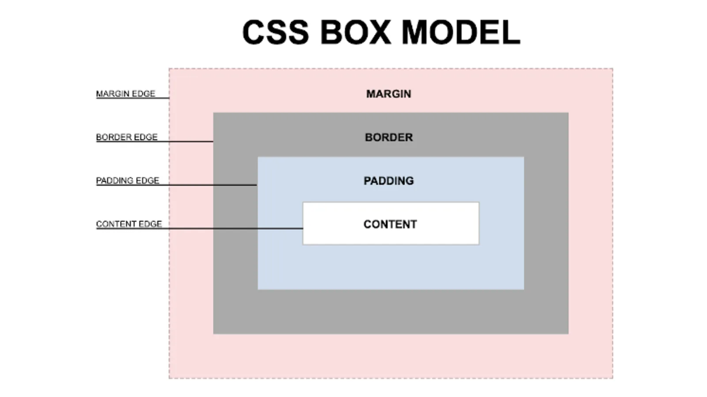

# Poznamky k lekci HTML a CSS (12.3.2022)

## Fonty

<a href="https://fonts.google.com/?query=er">Fonty Google</a>

<a href="https://color.adobe.com/cs/create/color-wheel">Barevný kruh Adobe</a>

<a href="https://flexboxfroggy.com/#cs">Žabička</a>

  

## Media Queries

  

<a href="https://flexboxfroggy.com/#cs">Žabička</a>
