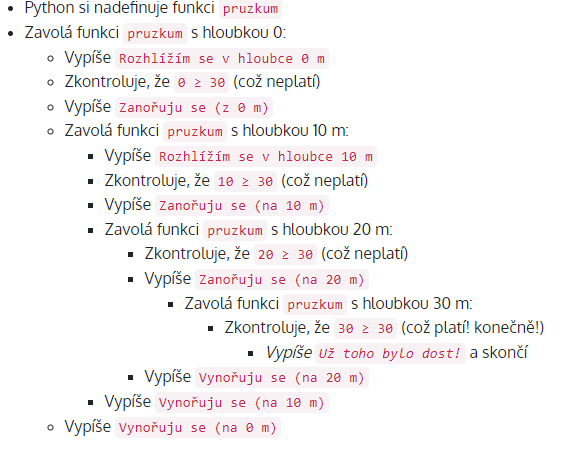

# Recursion

```Py
def pruzkum(hloubka):
    print(f'Rozhlížím se v hloubce {hloubka} m')

    if hloubka >= 30:
        print('Už toho bylo dost!')
    else:
        print(f'Zanořuju se (z {hloubka} m)')

        pruzkum(hloubka + 10)
        
        print(f'Vynořuju se (na {hloubka} m)')

pruzkum(0)
```

<p float="left">
  
    

Python si nadefinuje funkci pruzkum
Zavolá funkci pruzkum s hloubkou 0:
Vypíše Rozhlížím se v hloubce 0 m
Zkontroluje, že 0 ≥ 30 (což neplatí)
Vypíše Zanořuju se (z 0 m)
Zavolá funkci pruzkum s hloubkou 10 m:
Vypíše Rozhlížím se v hloubce 10 m
Zkontroluje, že 10 ≥ 30 (což neplatí)
Vypíše Zanořuju se (na 10 m)
Zavolá funkci pruzkum s hloubkou 20 m:
Zkontroluje, že 20 ≥ 30 (což neplatí)
Vypíše Zanořuju se (na 20 m)
Zavolá funkci pruzkum s hloubkou 30 m:
Zkontroluje, že 30 ≥ 30 (což platí! konečně!)
Vypíše Už toho bylo dost! a skončí
Vypíše Vynořuju se (na 20 m)
Vypíše Vynořuju se (na 10 m)
Vypíše Vynořuju se (na 0 m)
