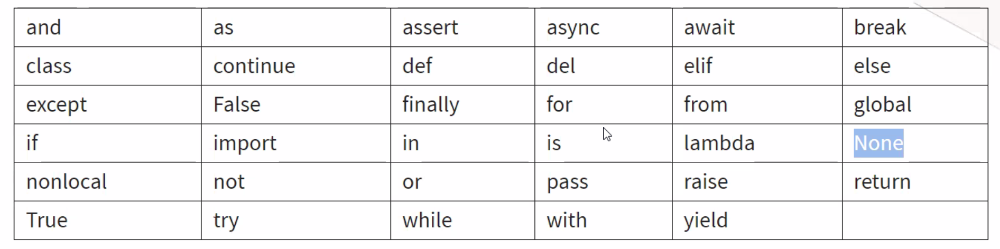
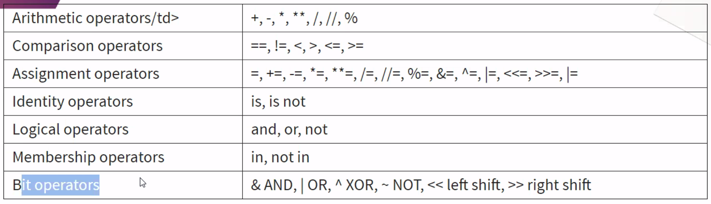

## 1st Lesson SDA

```Py
for x in range(10):
    print(x)
```

```Py
print("Ahoj", end=", ")
print("svete!")

print("Ahoj", "svete!", sep=", ")
```

## 2nd Lesson SDA (18th Sep 2021)

```Py
cislo = int("5")
print(type(cislo))

"""
Multiline comment
"""

```

### KeyWords

<p float="left">
  
    
### Operators
    
<p float="left">
  
    
```Py
print("abc" + "edf")          # spojovani stringu
print(("Hi" + " ") * 5)       # 

```
    
### Value Error
• Type
• Value
• Name
• ZeroError
• Syntax    
    
    
    
### Assigment operator
    
 ```Py
a = 5
a += 7
print(a)
    
```

```Py
print(False and False or True)
    
```   
    
### Separator
    
```Py
a = 123
b = "abc"
print(a, b, sep="-")    # 123-abc    
    
```
   
### Percent    
```Py
percent = 0.71
print(f"{percent: .1%}")  # will display 71.0%
```

    
### Prime Number
    
```Py
import math

num_to_check = 30
max_div = math.floor((num_to_check) ** (1/2))
prime = num_to_check % 2 == 0 and num_to_check % 3 == 0

for i in range(2, max_div):
    if num_to_check % i == 0:
        print('Not Prime')
        exit()

print(prime)    
 ```

## 3rd Lesson SDA (19th Sep 2021)
  
### Strings  
  
```Py  
sample_string = 'Hello, World!"'
print(sample_string[::-1])
```
    
### Data Types
    
```Py
print(type("Text to print"))
print(type(-17.0))
print(type(123.4))
print(type(False))
print(type(None))
    
```    

### Collection

• List (list)
• Dictionary (dict)
• Tuple
• Set	
