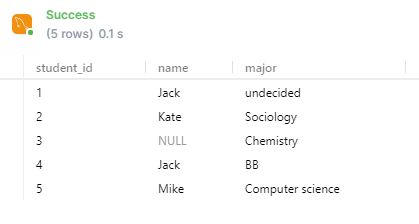

# SQL Labs

SQL - structured Query Language

```SQL
INT               -- Whole Numbers
DECIMAL(10,4)      -- Decimal Numbers (Exact Value)
VARCHAR(100)        -- String of text of lenght 1
BLOB              -- Binary Large Object, Store large data
DATE              -- YYYY-MM-DD
TIMESTAMP         -- YYYY-MM-DD HH:MM:SS
```


## MySQL Password
PythonSDA#22
Windows Service Name: MySQL80


```sql
CREATE TABLE student (
    student_id INT PRIMARY KEY,   -- definice sloupce + dat. typu
    name VARCHAR(20),             -- 20 pozic
    major VARCHAR(20)
);

```
## Creating a table

```sql
CREATE TABLE student (
    student_id INT,   -- definice sloupce + dat. typu
    name VARCHAR(20),             -- 20 pozic
    major VARCHAR(20),
    PRIMARY KEY(student_id)
);

DESCRIBE student;

DROP TABLE student;


ALTER TABLE student ADD gpa DECIMAL(3, 1);
-- pridani dalsiho sloupce
-- ADD add extra table onto the table

ALTER TABLE student DROP COLUMN gpa;  -- deleting specific column

```

## Constraints

• UNIQUE - nesmi se opakovat (duplicita)
• NOT NULL - nesmi byt prazdne
• DEFAULT 'value'
• Primary key je vzdy UNIQUE a NOT NULL

```sql
CREATE TABLE student (
    student_id INT,   -- definice sloupce + dat. typu
    name VARCHAR(20),             -- 20 pozic
    major VARCHAR(20)DEFAULT 'undecided',          -- defaultni honota
    PRIMARY KEY(student_id)
);


SELECT * FROM student;

INSERT INTO student(student_id, name) VALUES(1, 'Jack');

```
Automaticky inkrement

```sql
CREATE TABLE student (
    student_id INT AUTO_INCREMENT,   -- automaticke pridavani ID
    name VARCHAR(20),             -- 20 pozic
    major VARCHAR(20)DEFAULT 'undecided',          -- defaultnonota
    PRIMARY KEY(student_id)
);
```

## Update & Delete

```sql
-- Zaklad:
INSERT INTO student(student_id, name) VALUES(1, 'Jack');
INSERT INTO student VALUES(2, 'Kate', 'Sociology');
INSERT INTO student VALUES(3, NULL, 'Chemistry');
INSERT INTO student VALUES(4, 'Jack', 'BB');
INSERT INTO student VALUES(5, 'Mike', 'Computer science');
```

```sql
SELECT * FROM student;

UPDATE student
SET major = 'Bio'
WHERE major = 'Biology';

-- Other Comparsion ops:
-- = eqals
-- <> not equals
-- > greater than
-- < less than
-- >= grater than or equal
-- <= less than or equal
```

<p float="left">
  
    
Zmena hodnoty obsahu urcite hodnoty v tabulce

```sql
UPDATE student
SET major = 'ITC science'
WHERE major = 'Computer Science';
```
